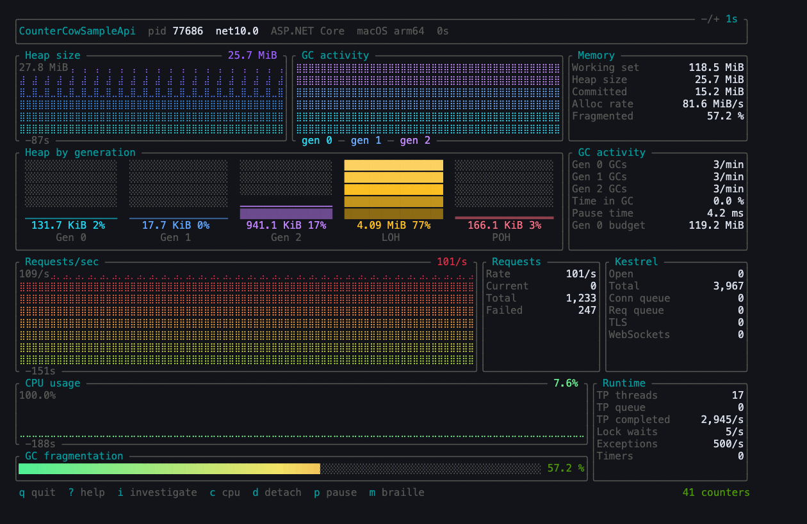
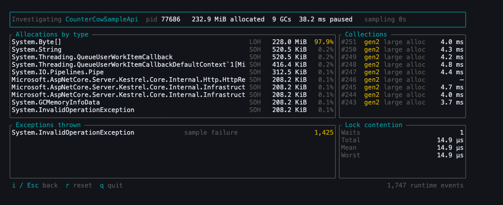
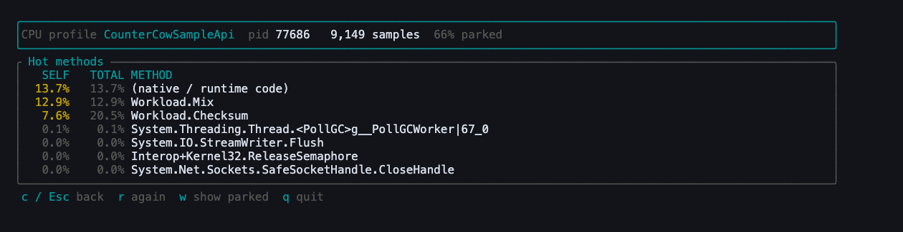

# countercow

**A `btop` for .NET.** Live runtime counters, allocation and GC forensics, and a CPU profiler —
one terminal binary, no .NET install required.

[](LICENSE)

`dotnet-counters` shows you the same telemetry as a flat, scrolling table of name/value pairs — no
history, no shape, no sense of what matters for the kind of app you're looking at. countercow is
the gap `btop` closed over `top`, and then some:

| | |
|---|---|
| **Watch** | Live counters with gradient-filled history graphs, laid out for the app you attached to. |
| **Investigate** | *What* is filling the heap, *why* each GC ran, what's throwing, what's blocking. |
| **Profile** | A five-second CPU profile ranking methods by self time. |

It is a single self-contained Rust binary that speaks the .NET Diagnostics IPC and EventPipe
protocols directly over a Unix socket — **no .NET SDK, no `dotnet-counters`, no managed dependency
at runtime**. Works against .NET 6 through 10, on Linux and macOS.



Every graph is filled from the baseline and coloured by height, so a spike changes colour as it
climbs rather than only getting taller. One sample per sub-column, no interpolation: what you see
is what the runtime reported, and the newest reading is always at the right edge. CPU is the one
counter with a real ceiling, so it holds a fixed 0–100% scale — a process ticking over at 7% looks
like a process ticking over at 7%, not like one on fire.

Beside the heap trend is a timeline of collections, stacked and coloured by generation to match
the bars below it. The counters behind it are rates, which on anything but a busy process read
zero and look broken; as a timeline a quiet process is visibly quiet rather than apparently dead,
and a gen 2 collection is a mark you can point at.

The layout adapts to the process: this is an ASP.NET Core app, so it gets request and Kestrel
panels. See [What it shows](#what-it-shows).

## Usage

```bash
countercow                 # pick a process from a list
countercow --pid 1234      # attach directly
countercow --name MyApi    # attach by name
countercow --interval 0.5  # start at a different refresh rate (default: 1s)
countercow ps              # list attachable processes and exit
```

| Key | |
|---|---|
| `q` | quit |
| `d` / `Esc` | back: detach and pick another process |
| `i` | investigate: allocations, GC causes, exceptions, contention |
| `c` | CPU profile: which methods are burning time |
| `p` | pause history (the session keeps running) |
| `-` / `+` | refresh 100 ms faster / slower |
| `m` | cycle braille / block / octant plotting |
| `?` | help |

Detaching closes the EventPipe session properly and re-discovers processes, so it picks up
anything that has started since — handy when the thing you want to watch is still building.

Counters start flowing the moment you attach — the session opens before the first frame, and
nothing needs starting by hand. (Investigating and profiling are the exceptions, and deliberately
so: both cost the target real CPU, so they run only while you are looking at them.)

Counters refresh **once a second** by default. `-` and `+` move that by 100 ms at a time between
0.1s and 10s, the same step and range as btop's update timer, and the rate in force is always shown
in the top right corner. `--interval` sets where it starts.

The runtime is told the rate when the counter session opens and there is no way to change it in
place, so a change means closing that session and opening another. Because a step is only 100 ms,
the change is applied once the keypresses stop rather than on each one — otherwise getting from one
second to two would open ten sessions against the target in about as many frames.

The rate is a request, not an instruction, and one you may not win. An EventSource polls its
counters on a single timer shared by every session watching it, so if anything else is already
watching — another countercow, `dotnet-counters`, or a session leaked by one of them that was
killed rather than closed — that tool's rate is the one the provider uses, for both of you. It is
per provider, so half the dashboard can be on your rate and half on someone else's. countercow
plots whatever arrives at whatever cadence it arrives, because every reading carries the moment it
was recorded; `cargo run --example rate_probe -- <pid>` reports the cadence each provider is
actually publishing at, which is the way to tell.

History is kept across the change. Every reading is stamped with the moment it arrived, so a graph
reports how far back it reaches from the readings themselves rather than by multiplying its sample
count by the current rate — which would be wrong for everything gathered before the change.

## Investigating

Counters tell you *that* the heap is growing. `i` tells you *what* is growing it:



That reads as one causal story: byte arrays are going to the large object heap, which is forcing
gen 2 collections, at ~4 ms of pause each.

This opens a **second** EventPipe session carrying `Microsoft-Windows-DotNETRuntime` events, and
unlike counters it costs the target real CPU — counters arrive at roughly 40 events/second, where
the GC keyword alone produced ~1,600/second on a loaded app. So the session exists only while that
screen is open, and is closed the moment you leave. Findings are kept when you flick back to the
dashboard; `r` clears them.

Allocation counts are *sampled* — the runtime emits a tick roughly every 100 KB of small-object
allocation, and per large-object allocation — so treat the byte totals as a good estimate of where
pressure comes from rather than an exact ledger.

## CPU profiling

`c` runs a fixed five-second profile and ranks methods by self time:



**Self** is time with the method as the innermost frame — time spent *in* it. **Total** includes
its callees, so `Checksum` at 20.5% is its own 7.6% plus the 12.9% it spends inside `Mix`.
Ranking is by self, because a list sorted by total is topped by whatever sits at the bottom of
every stack.

Unlike the other screens this one is not live, and cannot be. Stack frames arrive as bare
instruction pointers; the table mapping them to method names is only emitted when the session
*stops*. So a profile is necessarily "collect for a window, then resolve".

Two things worth knowing about the numbers:

- **Parked threads are excluded by default.** The sampler measures thread time, not CPU time — it
  samples every thread on every tick, including ones asleep in a wait. Unfiltered, the list is
  topped by whichever thread idles longest. The header reports what share was parked, and `w`
  shows them anyway. The runtime *does* tag each sample with a type that should make this
  distinction, but on macOS/arm64 every sample reports `External`, measured across 27,000 samples
  of a busy process — so parked threads are identified from their stacks instead.
- **`(native / runtime code)` is normal and often large.** The GC, the JIT and syscalls are not
  jitted methods and have no names to resolve to. Naming them anything else would be a guess.

## What it shows

The dashboard adapts to the process. **ASP.NET Core** apps get request and Kestrel connection
panels alongside the GC view; everything else gets a wider runtime and JIT view instead.

There is no "is this ASP.NET" flag anywhere in the diagnostics protocol, and subscribing to a
provider no application implements succeeds silently rather than failing. So countercow subscribes
optimistically and shows a panel once its provider actually reports. Panels are hidden, never shown
empty.

GC and memory get the most room on both layouts, because that is usually what you attached to find
out about.

## Building

```bash
cargo build --release
```

**Requires Rust 1.88+**, verified by building and running the full suite on 1.88 and 1.92, not
just declared. No other dependencies.

The floor is ratatui's. `sysinfo` is pinned to 0.38 rather than 0.39 for the same reason — 0.39
raised its own floor to 1.95 without needing anything this uses — and pinned *exactly* because
sysinfo changes its API across minor versions, so a float there breaks builds rather than merely
moving them.

```bash
scripts/msrv-report.sh            # what the dependency tree actually demands
scripts/crate-msrv-history.sh sysinfo   # how far back a crate stays compatible
```

## How it works

Three layers, bottom-up:

| Module | |
|---|---|
| `src/ipc/` | The Diagnostics IPC protocol: socket discovery, message framing, `ProcessInfo`, `CollectTracing2`. Ported from `dotnet/diagnostics`. |
| `src/nettrace/` | The nettrace V4 stream format with V5 metadata tags — FastSerializer framing, block dispatch, compressed event headers, metadata and payload decoding. |
| `src/counters/` | Turning `EventCounters` events into samples, and knowing how to present them. |
| `src/runtime/` | The investigation session: GC, allocation, exception and contention events. |
| `src/profile/` | CPU profiling: samples, stacks, the method rundown, and hot-method ranking. |

Counter display names and units are read off the wire rather than from a table, because the
runtime sends them in every payload — and because the table that used to hold them
(`KnownData.cs`) was deleted from `dotnet/diagnostics` in 2024.

A few things in this protocol fail *silently* rather than loudly, and are worth knowing if you're
reading the code:

- **The socket directory is `$TMPDIR`, not `/tmp`.** On macOS that's a per-user sandbox path, so
  globbing `/tmp` finds nothing at all even with a dozen .NET processes running. It also means
  `sudo countercow` searches *root's* `$TMPDIR` on macOS and finds less than running unprivileged,
  not more — which is why the empty-list screen names the directory it searched.
- **Most sockets on disk are stale.** A typical developer machine has far more dead socket files
  than live processes. The filename embeds the process start time, which countercow checks against
  the live process to avoid attaching to a recycled PID — a guard the reference client doesn't have.
- **Kestrel's EventCounter provider is hyphenated** (`Microsoft-AspNetCore-Server-Kestrel`). The
  dotted form is the .NET 8+ *Meter*, a different mechanism. Subscribe to the wrong one and you get
  no error and no data.
- **The `Trace` object has no size prefix or alignment padding**, unlike every other nettrace
  block. Treating it like the others desynchronises the whole stream.
- **V1 and V2 metadata field lists are ordered oppositely** — type-then-name versus
  size-then-name-then-type.
- **After `StopTracing` you must keep draining the original socket** — *while the stop is in
  flight*, not just afterwards. If the streaming socket's buffer fills, the runtime blocks writing
  to it and never processes the stop, so a caller that pauses its reader to issue the stop
  deadlocks. Only shows up on high-volume sessions.
- **`Microsoft-Windows-DotNETRuntime` is manifest-based**, so unlike EventSource providers it
  sends no event names and no field lists — only a numeric id. Its payloads can only be decoded
  from schemas hardcoded per `(id, version)`.
- **Stack ids are recycled** after a sequence point, but stack blocks also lag the events that
  reference them. Resolving eagerly loses most samples; resolving at the end reads the wrong
  stacks and silently yields addresses in no method at all. Two generations of stack table,
  rotated at each sequence point, is what gets both right.

v1 reads EventCounters, which work unchanged from .NET 6 through .NET 10. The newer
`System.Diagnostics.Metrics` meters arrived piecemeal (ASP.NET Core in .NET 8, `System.Runtime`
only in .NET 9) and are a natural v2.

## Testing

```bash
cargo test
```

Unit tests cover the byte-level rules that fail silently. Beyond those:

- **`tests/fixtures/*.nettrace`** are real streams captured from real runtimes — .NET 8, 9 and 10,
  ASP.NET and console, idle and under load. Synthetic tests only prove the parser matches my
  reading of the spec; these prove it matches what runtimes actually emit.
- **`tests/dashboard.rs`** renders both layouts from that fixture data at sizes from 200x60 down to
  20x5.

```bash
cargo run --example preview -- [aspnet|generic|loaded|console|investigate|profile] [w] [h]
cargo run --example capture -- <pid> <path> [seconds] [counters|runtime|profile]
cargo run --example profile_cli -- <pid> [seconds] [--all] [--stacks]
cargo run --example probe -- <pid> <provider> <keywords-hex> [seconds] [ids]
cargo run --example rate_probe -- <pid> [seconds]
```

`preview` draws any screen from fixture data with no process attached, which is how UI changes are
reviewed: plain text by default so a diff shows them, `--colour` or `--html` when the change is to
the colours. The screenshots in this README are that HTML screenshotted, so they can be
regenerated rather than going stale:

```bash
scripts/preview-png.sh loaded 120 40 60 docs/dashboard.png
```

`rate_probe` checks the one thing no test can reach without a live runtime: that `-` and `+` really
do close one EventPipe session and open another at the new rate.

`probe` is the investigation tool: it subscribes to any provider and reports what actually
arrives, including raw payload bytes. Every hardcoded event layout in `src/runtime/` and
`src/profile/` was derived and verified with it, and it is the way to re-verify on a runtime
version this has not seen.

`testapps/` holds a small ASP.NET Core API and a console app that move counters in recognisable
ways — endpoints for allocating, retaining, throwing and queueing work. They multi-target so the
parser can be checked against several runtimes:

```bash
dotnet run --project testapps/aspnet-sample -f net10.0 -- --urls http://localhost:5199
scripts/drive-load.sh http://localhost:5199 20
countercow --name CounterCowSampleApi
```

## Releases

Every push to `main` runs the tests, and if they pass bumps the minor version, tags it and builds
[a release](https://github.com/tbbuck/countercow/releases) — so the minor number counts pushes
rather than describing them, and there is no release ritual to forget to perform. It is one
workflow rather than several because the ordering is the point: nothing is tagged until the tests
have agreed to it, which separate workflows triggered by the same push cannot express.

`Cargo.toml` therefore holds the version that was last *released*, not the one being worked on:
the bump is part of releasing, so it happens in CI rather than in the commit that earned it.

Prebuilt binaries cover Linux and macOS, x86-64 and arm64 each
(`{x86_64,aarch64}-unknown-linux-gnu`, `{x86_64,aarch64}-apple-darwin`). Every one is a `.tar.gz`
holding the binary, this README and the licence, with a `SHA256SUMS` alongside to check them
against:

```bash
tar xzf countercow-1.3.0-aarch64-apple-darwin.tar.gz
sudo install countercow-1.3.0-aarch64-apple-darwin/countercow /usr/local/bin
```

There is no Windows build. The diagnostics protocol is the same there, but it arrives over a named
pipe rather than a Unix socket, so supporting it is a piece of work rather than a build target.

Two things the binaries do not do for you. The Linux ones link against the glibc of the runner that
built them, so a distribution more than a couple of years old wants a [build from
source](#building) instead. The macOS ones are not notarised, so a browser download arrives
quarantined — `xattr -d com.apple.quarantine` on the extracted binary clears it, and fetching with
`curl` never sets it in the first place.

## Licence

MIT — see [LICENSE](LICENSE).

countercow is an independent reimplementation of protocols Microsoft documents and implements in
the open. Nothing here is copied, but the wire formats were derived by reading, and verified
against, these MIT-licensed projects — credit where it is due:

- [dotnet/diagnostics](https://github.com/dotnet/diagnostics) — the Diagnostics IPC protocol spec
  and the reference client this one is modelled on.
- [microsoft/perfview](https://github.com/microsoft/perfview) — where the nettrace format is
  actually specified, and the TraceEvent reader that settles what the spec leaves ambiguous.
- [dotnet/runtime](https://github.com/dotnet/runtime) — the writer, which is the final authority
  whenever the two disagree.
